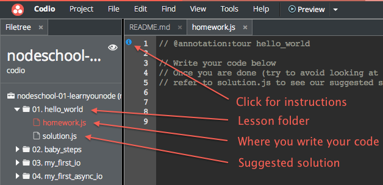

#Tutorial 01 - Learn You Node
**Learn the basics of node: asynchronous i/o, http**

*All content is written and produced by [http://nodeschool.io](http://nodeschool.io). Please see the credits at the bottom of this page and if you have learnt a lot from these tutorials, please make a donation (also at the bottom).*

##One time setup for this module
First of all, we'll install the tutorial

1. Open up the Console from 'Tools->Terminal'
1. Enter `npm install -g learnyounode`. This will download and install the tutorial into your project container.

##Start coding!
Each lesson in the module is contained within a folder. Inside each folder are a couple of files

- `<lesson_name.js>` the actual name is the same name as the folder without the chapter number. This is where you write your code for the lesson.
- `solution.js` don't peak until you've done the lesson yourself, but this is the suggested solution.

###Lesson Instructions
At the top of the lesson file, you will see a blue icon in the gutter of the first line of code. Click on it and the instructions for the lesson will appear.

##Running your code
When you're ready to test your code, look for the 'Run' item in the top menu. The tutorial system will automatically supply any required arguments to your project.

##Using Node to test your code
If you want to control the run phase yourself and supply your own arguments, then you can always run your code using node directly. Open up a terminal window from the 'Tools->Terminal' menu item and then `cd` into the folder where your code is located, then execute it with 

    node <yourcode.js> [arg1, arg2, ...., argn]

##Verifying your code
Once you think you have completed the challenge, select the 'Verify Lesson' option from the 'Run' dropdown menu and then press the button. The output will be shown in the console window. If is passes, you will see something like this

##Which lessons have I successfully completed?
If you press the "Completed Lessons" command from the same menu, you will be shown in the console the list of all challenges that are already completed.

##Cheating (checking the recommended solution)
Each lesson comes with a `solution.js` file. Try to avoid looking at it other than for verification purposes. We have highly sophisticated algorithms built into Codio that will detect any forms of cheating, peeking (however quick and subtle) and will publicly expose to your peers.

##Doing everything from the command line
For completeness sake, you can do everything from the command line rather than using Codio. 

Each tutorial is installed as node module that can be run from the command line. If you take a look at the [http://nodeschool.io](http://nodeschool.io) documentation, you can see how everything can be done from the command line.

##Other Tutorials
[http://nodeschool.io](http://nodeschool.io) has a several excellent tutorials. We have packaged these up so they run within Codio and the full set can be found on our [Nodeschool Tutorial page.](http://codio.com/tutorials)

##Credits

The Nodeschool tutorials are the much excellent work of the following hackers

Rod Vagg ([github/rvagg](https://github.com/rvagg), [twitter@rvagg](http://twitter.com/rvagg)), 
Andrey Sidorov ([github/sidorares](https://github.com/sidorares), [twitter@sidorares](http://twitter.com/sidorares)), 
Julián Duque ([github/julianduque](https://github.com/julianduque), [twitter@julian_duque](http://twitter.com/julian_duque)), 
Lars-Magnus Skog ([github/ralphtheninja](https://github.com/ralphtheninja), [twitter@ralphtheninja](http://twitter.com/ralphtheninja)), 
Tim Inman ([github/thehack](https://github.com/thehack), [twitter@timinman](http://twitter.com/timinman)), 
Dan Flettre ([github/Flet](https://github.com/Flet), [twitter@flettre](http://twitter.com/flettre)) 

##Donations
If you feel you have benefitted from this or the other tutorials, how about [donating to Rodd Vagg using gittip](https://www.gittip.com/rvagg/)?
